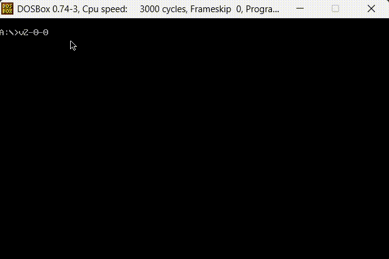

# REP0006 - Base-N Magic Explainer

An Assembly application that converts a Base-N number to another Base-N format, explaining the process step by step.

---

## Features

This MASM-based program allows you to:

1. **Select a source Base-N system.**
2. **Input a number to evaluate.**
3. **Choose a target Base-N system.**
4. **Display a step-by-step explanation of the conversion process from one base to another.**

### Additional Functionality

- At any step, the program allows you to return to **Step 1**.
- At any step, the program allows you to return to the **previous step**.

### Functionality Example



### Supported Bases

- **Base-2** (Binary)
- **Base-8** (Octal)
- **Base-10** (Decimal)
- **Base-16** (Hexadecimal)

---

## Example Workflow

1. Select **Base-10** as the source system.
2. Input the number **255**.
3. Choose **Base-16** as the target system.
4. The program will display the conversion process, explaining each step in detail.

---

## How to Run

### Prerequisites

Make sure you have the following programs installed on your system:

- **MASM**
- **DOS-Box**
- **Emu8086**

If you don't have them, you can download them from these links:

- [Download Emu8086](https://www.mediafire.com/file/cmlywa0zjr6p5bj/emu-8086.rar/file)
- [Download DOS-Box](https://www.dosbox.com/download.php?main=1)
- [Download MASM611](https://www.mediafire.com/file/qel4nxtcsg93n68/masm611.rar/file)

---

## Installation Steps

1. **Install Emu8086**  
   Follow the installation wizard to complete the setup.

2. **Unzip MASM611**  
   Extract the contents of the downloaded file into the directory:  
   `C:/MASM/masm611/`  
   Ensure that subdirectories like `BIN`, `LIB`, and `HELP` are present.

3. **Install DOS-Box**  
   Complete the installation by following the wizard.

4. **Open DOS-Box**  
   Launch DOS-Box. Keep the terminal open.

---

## Running the Project

1. **Download the Project**  
   Place the project folder _Base-N Magic Explainer_ in the folder:  
   `C:/MASM/masm611/BIN/`

2. **Mount the Directory in DOS-Box Terminal**  
   In the DOS-Box terminal, run the following command:

   ```bash
   mount c: c:\MASM\masm611\BIN
   ```

3. **Look for your classes and folder names**
   You need to verify the classpah name in the terminal of DOS-Box because may the names are not the same there, so:

   1. Locate into the `C:` virtual disk with the command `C:`
   2. With the _Base-N Magic Explainer_ folder located into `BIN`, try `dir` to see what's the name of the folder
   3. With the `{folder_name}`, go to `{folder_name}\code` and use `dir` to see the name of the `converser_init.asm` file
   4. Remember, the file to execute is 'converser_init.asm'.

4. **Compile and Run the project**  
   In the DOS-Box terminal, run the following commands one by one:

   ```bash
   cd {folder_name}\code\{asm_file_name}
   ML converser_init.asm
   converser_init.exe
   ```

   where _folder_name_ is the folder name provided by DOS-Box terminal, and _asm_file_name_ is the file name provided by DOS-Box terminal.

---

## License

This project is licensed under the [MIT License](LICENSE).

---

## Author

Developed by [_A-Cubica-R_](https://www.linkedin.com/in/adolfo-alejandro-arenas-ramos/). Feel free to reach out for questions or suggestions!

---

Enjoy converting numbers with ease and clarity!
